# NSG Tool System Architecture with AI-Powered Remediation

## Enhanced System Design with OpenAI & AutoGen Integration


## AI-Powered Remediation Workflow


## AutoGen Multi-Agent System Architecture

```mermaid
graph TD
    subgraph "AutoGen Agent Framework"
        subgraph "Agent Roles"
            COORD["🎯 Coordinator Agent<br/>- Issue triage<br/>- Task delegation<br/>- Progress monitoring"]
            NSG_AGENT["🛡️ NSG Specialist Agent<br/>- NSG rule analysis<br/>- Security policy expertise<br/>- Rule optimization"]
            ASG_AGENT["⚖️ ASG Specialist Agent<br/>- ASG policy analysis<br/>- Compliance checking<br/>- Policy remediation"]
            EXEC_AGENT["⚡ Execution Agent<br/>- Azure API calls<br/>- Change implementation<br/>- Rollback capability"]
            REVIEW_AGENT["🔍 Review Agent<br/>- Change validation<br/>- Risk assessment<br/>- Approval workflow"]
        end
        
        subgraph "Agent Communication"
            MSG_BUS["Message Bus"]
            STATE_MGR["State Manager"]
            TASK_QUEUE["Task Queue"]
        end
        
        subgraph "OpenAI Integration"
            GPT4["GPT-4 Turbo<br/>Strategic Planning"]
            GPT35["GPT-3.5 Turbo<br/>Code Generation"]
            EMBEDDINGS["Text Embeddings<br/>Knowledge Retrieval"]
        end
    end
    
    %% Agent Interactions
    COORD --> NSG_AGENT
    COORD --> ASG_AGENT
    NSG_AGENT --> EXEC_AGENT
    ASG_AGENT --> EXEC_AGENT
    EXEC_AGENT --> REVIEW_AGENT
    REVIEW_AGENT --> COORD
    
    %% Communication Layer
    COORD <--> MSG_BUS
    NSG_AGENT <--> MSG_BUS
    ASG_AGENT <--> MSG_BUS
    EXEC_AGENT <--> MSG_BUS
    REVIEW_AGENT <--> MSG_BUS
    
    MSG_BUS <--> STATE_MGR
    MSG_BUS <--> TASK_QUEUE
    
    %% OpenAI Integration
    COORD --> GPT4
    NSG_AGENT --> GPT35
    ASG_AGENT --> GPT35
    REVIEW_AGENT --> GPT4
    
    NSG_AGENT --> EMBEDDINGS
    ASG_AGENT --> EMBEDDINGS
    
    classDef agent fill:#e3f2fd
    classDef communication fill:#f1f8e9
    classDef ai fill:#fce4ec
    
    class COORD,NSG_AGENT,ASG_AGENT,EXEC_AGENT,REVIEW_AGENT agent
    class MSG_BUS,STATE_MGR,TASK_QUEUE communication
    class GPT4,GPT35,EMBEDDINGS ai
```



## Remediation Decision Tree

```mermaid
flowchart TD
    START(["Validation Issue Detected"])
    ANALYZE{"Issue Analysis"}
    
    NSG_ISSUE["NSG Rule Issue"]
    ASG_ISSUE["ASG Policy Issue"]
    COMPLEX_ISSUE["Complex Multi-Service Issue"]
    
    %% NSG Path
    NSG_TYPE{"NSG Issue Type"}
    NSG_MISSING["Missing Rule"]
    NSG_OVERPERM["Over-Permissive Rule"]
    NSG_CONFLICT["Rule Conflict"]
    
    NSG_AUTO_FIX["🤖 Auto-Generate Rule"]
    NSG_RESTRICT["🔒 Apply Restrictions"]
    NSG_RESOLVE["⚖️ Resolve Conflicts"]
    
    %% ASG Path
    ASG_TYPE{"ASG Issue Type"}
    ASG_POLICY["Policy Violation"]
    ASG_COMPLIANCE["Compliance Issue"]
    ASG_CONFIG["Configuration Error"]
    
    ASG_UPDATE["📋 Update Policy"]
    ASG_COMPLY["✅ Apply Compliance"]
    ASG_RECONFIG["⚙️ Fix Configuration"]
    
    %% Complex Path
    MULTI_AGENT["🎯 Multi-Agent Coordination"]
    STRATEGY["📊 Generate Strategy"]
    PARALLEL["⚡ Parallel Execution"]
    
    %% Execution
    VALIDATE{"Pre-execution Validation"}
    EXECUTE["🚀 Execute Changes"]
    VERIFY["✓ Verify Results"]
    ROLLBACK["↩️ Rollback if Failed"]
    SUCCESS(["✅ Remediation Complete"])
    FAILURE(["❌ Manual Intervention Required"])
    
    START --> ANALYZE
    ANALYZE --> NSG_ISSUE
    ANALYZE --> ASG_ISSUE
    ANALYZE --> COMPLEX_ISSUE
    
    NSG_ISSUE --> NSG_TYPE
    NSG_TYPE --> NSG_MISSING
    NSG_TYPE --> NSG_OVERPERM
    NSG_TYPE --> NSG_CONFLICT
    
    NSG_MISSING --> NSG_AUTO_FIX
    NSG_OVERPERM --> NSG_RESTRICT
    NSG_CONFLICT --> NSG_RESOLVE
    
    ASG_ISSUE --> ASG_TYPE
    ASG_TYPE --> ASG_POLICY
    ASG_TYPE --> ASG_COMPLIANCE
    ASG_TYPE --> ASG_CONFIG
    
    ASG_POLICY --> ASG_UPDATE
    ASG_COMPLIANCE --> ASG_COMPLY
    ASG_CONFIG --> ASG_RECONFIG
    
    COMPLEX_ISSUE --> MULTI_AGENT
    MULTI_AGENT --> STRATEGY
    STRATEGY --> PARALLEL
    
    NSG_AUTO_FIX --> VALIDATE
    NSG_RESTRICT --> VALIDATE
    NSG_RESOLVE --> VALIDATE
    ASG_UPDATE --> VALIDATE
    ASG_COMPLY --> VALIDATE
    ASG_RECONFIG --> VALIDATE
    PARALLEL --> VALIDATE
    
    VALIDATE -->|Pass| EXECUTE
    VALIDATE -->|Fail| FAILURE
    EXECUTE --> VERIFY
    VERIFY -->|Success| SUCCESS
    VERIFY -->|Failure| ROLLBACK
    ROLLBACK --> FAILURE
    
    classDef start fill:#c8e6c9
    classDef decision fill:#fff3e0
    classDef action fill:#e3f2fd
    classDef end fill:#ffcdd2
    classDef success fill:#c8e6c9
    
    class START start
    class ANALYZE,NSG_TYPE,ASG_TYPE,VALIDATE decision
    class NSG_AUTO_FIX,NSG_RESTRICT,NSG_RESOLVE,ASG_UPDATE,ASG_COMPLY,ASG_RECONFIG,MULTI_AGENT,STRATEGY,PARALLEL,EXECUTE,VERIFY,ROLLBACK action
    class FAILURE end
    class SUCCESS success
```

## API Endpoints Architecture


## Email Scheduling System


## Data Flow Architecture


## Component Hierarchy


## Enhanced Technology Stack with AI Integration


## Implementation Roadmap

